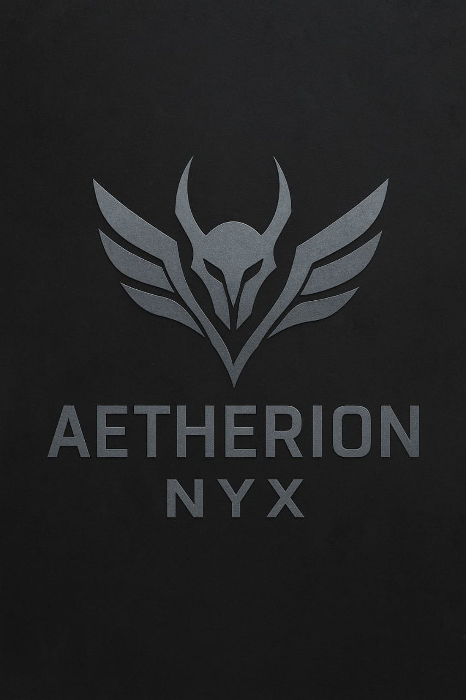
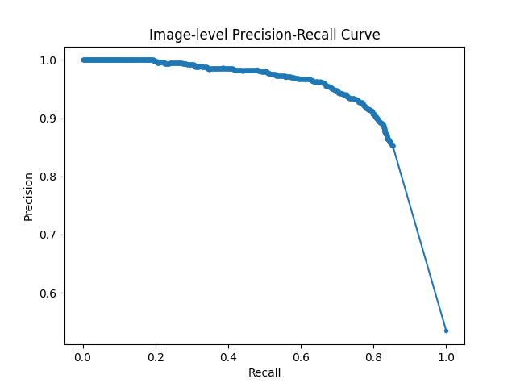
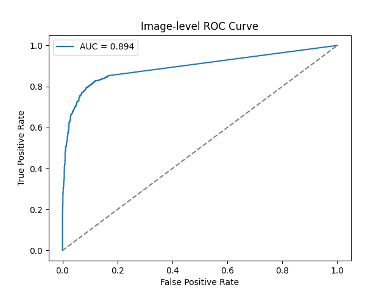
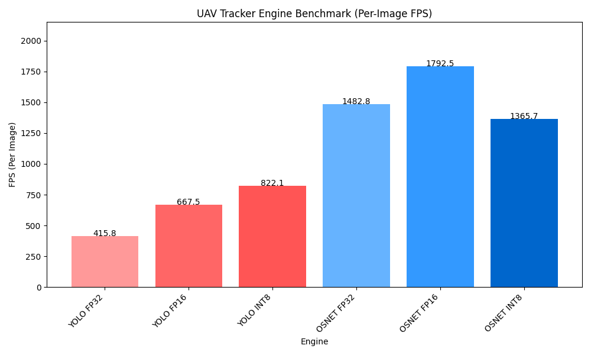

# 🪽 Aetherion-Nyx 🚁
<p align="center">
  
</p>


**Real-time UAV Detection & Tracking System** using **C++**, OpenCV, YOLOv8n, and OSNet embeddings. 🚨📡

---

## Overview

Aetherion-Nyx is a **high-performance UAV tracker** built on **WSL2** using **C++**:

- **YOLOv8n**: Fully fine-tuned on UAV dataset 🪽  
- Exported to **ONNX**, then converted to **TensorRT engines (FP16/FP32/INT8)** ✅  
- **OSNet embeddings** for multi-object re-identification  
- **Kalman Filter + Hungarian algorithm** for robust multi-UAV tracking 🚁  


---

## Demo GIF & Video

<p align="center">
  
</p>


---

## Performance Visuals 📊📉

**Precision-Recall Curve**  

<p align="center">
  
</p>

**ROC Curve**  

<p align="center">
  
</p>

**Benchmark**  

<p align="center">
  
</p>

---

## Setup Instructions ✅

### 🐙 Git Clone

```bash
git clone https://github.com/aditrisingh/Aetherion-Nyx.git
cd Aetherion-Nyx
````

### 🐳 Docker Setup

Dockerfile uses **NVIDIA TensorRT base container**:

```bash
docker build -t aetherion-nyx .
docker run --gpus all -it --rm aetherion-nyx
```

You’ll land in `/app` inside the container. Run tracker manually from here.

---

### 💻 Compilation (C++ / OpenCV / TensorRT)

Inside **WSL2** or Docker:

```bash
g++ -O3 tracker.cpp -o tracker \
-I/mnt/c/Users/Aditri/Desktop/Drone/TensorRT-8.6.1.6/include \
-I/usr/local/cuda/include \
-I/usr/local/cudnn-8.6/include \
-I/usr/include/opencv4 \
-L/mnt/c/Users/Aditri/Desktop/Drone/TensorRT-8.6.1.6/lib \
-L/usr/local/cuda/lib64 \
-lopencv_core -lopencv_imgproc -lopencv_highgui -lnvinfer -lnvonnxparser -lcuda -lcudart
```

Run:

```bash
./tracker
```

---

## Configuration

Edit `tracker.cpp` paths & settings:

```cpp
const string YOLO_ENGINE_PATH = "path/to/yolov8n_fp32.engine";
const string OSNET_ENGINE_PATH = "path/to/osnet_fp32.engine";
const string VIDEO_PATH = "path/to/video.mp4";
const bool USE_WEBCAM = false; // true for webcam
```

Other params:

* `CONF_THRESH = 0.29f`
* `IOU_THRESH = 0.45f`
* `TRACK_MAX_AGE = 5`
* `EMB_THRESH = 0.5f`

---

## Key Features 🪽🚁✅

* Real-time UAV detection & tracking
* YOLOv8n fine-tuned for UAVs
* Multi-object tracking using **Kalman Filter + Hungarian Algorithm**
* Re-identification with OSNet embeddings
* Performance metrics & visualizations 📊📉


---

## License

MIT License

```


